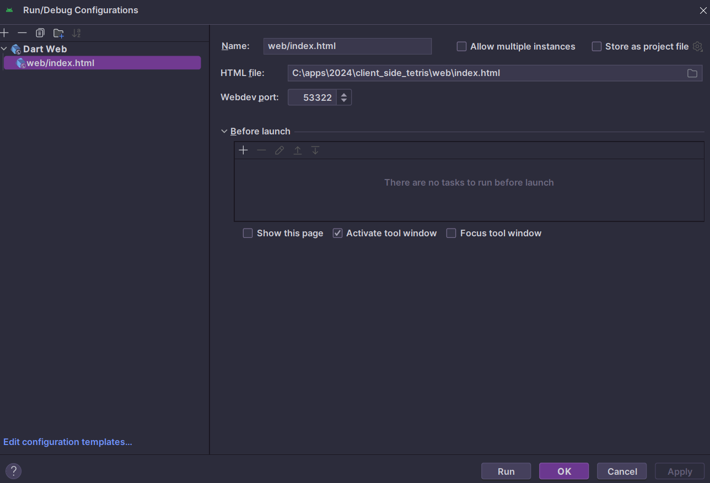

A bare-bones Dart web app.

Uses [`package:web`](https://pub.dev/packages/web) for the web app framework.

This repository is created in order to Client Side Programming in Dart without using Flutter framework and will serve as a base to understand server side code in Dart. 

## Running and building

If you are using IntelliJ/ Android Studio, choose new configuration as Dart Web and set the root `index.html` in the configuration as `web/index.html`



To run the app, use these commands:
```
dart pub global activate webdev
webdev serve
```

To build a production version ready for deployment, use these commands:
```
webdev build
```

For more details, see https://dart.dev/web/get-started
